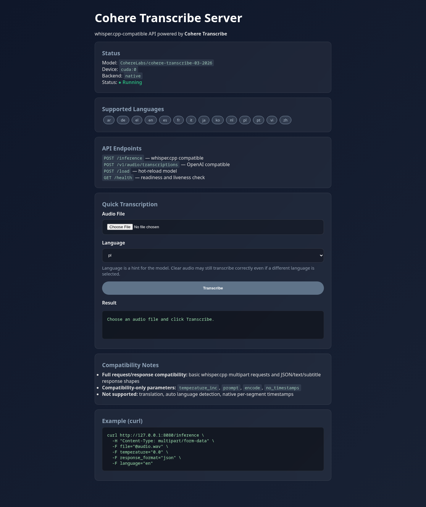

# cohere-transcribe-server-api

`whisper.cpp`-compatible HTTP API powered by [`CohereLabs/cohere-transcribe-03-2026`](https://huggingface.co/CohereLabs/cohere-transcribe-03-2026).

The goal is practical compatibility with existing `whisper.cpp` clients: same main routes, familiar multipart request shapes, and matching response formats where supported. It is not a full reimplementation of every `whisper.cpp` feature.

## Overview

- `POST /inference` for `whisper.cpp`-style multipart transcription requests
- `POST /v1/audio/transcriptions` for OpenAI-like clients
- `POST /load` for hot-reloading the active model
- `GET /` for the built-in HTML status page and browser upload form
- `GET /health` for liveness and readiness checks
- Docker and Compose workflows for running the service

Incoming audio is normalized before inference:

- multi-channel audio is mixed down to mono
- input sample rates are resampled to `16 kHz`
- WAV, MP3, FLAC, OGG and other decodable formats are accepted through `soundfile` with a `librosa` fallback

## Quick Start

### Local Python

```bash
pip install -r requirements.txt
python server.py --host 0.0.0.0 --port 8080
```

With explicit options:

```bash
python server.py \
  --model CohereLabs/cohere-transcribe-03-2026 \
  --host 0.0.0.0 \
  --port 8080 \
  --language en
```

### Docker / Compose

```bash
docker build -t cohere-transcribe-server-api .
docker run --gpus all -p 8080:8080 cohere-transcribe-server-api
```

```bash
docker compose up --build
```

If you use the gated Hugging Face model, export `HF_TOKEN` before startup:

```bash
export HF_TOKEN=hf_your_token_here
docker compose up -d
```

The provided Compose file:

- binds the API to `127.0.0.1:8080`
- joins the external Docker network `bridge-network`
- persists Hugging Face cache under `/opt/cohere-transcribe/data`

## API

### `POST /inference`

Main `whisper.cpp`-compatible endpoint.

| Parameter | Type | Default | Notes |
|-----------|------|---------|-------|
| `file` | file | required | Audio file, normalized to mono `16 kHz` before inference |
| `temperature` | float | `0.0` | Passed through to transcription |
| `temperature_inc` | float | `0.2` | Accepted for compatibility, not applied |
| `response_format` | string | `json` | `json`, `text`, `verbose_json`, `srt`, `vtt` |
| `language` | string | `en` | ISO 639-1 language code |
| `prompt` | string | unset | Accepted for compatibility, not applied |
| `encode` | bool | `true` | Accepted for compatibility, not applied |
| `no_timestamps` | bool | `false` | Accepted for compatibility, not applied |
| `translate` | bool | `false` | Accepted, but translation is not supported |

```bash
curl http://127.0.0.1:8080/inference \
  -H "Content-Type: multipart/form-data" \
  -F file="@audio.wav" \
  -F temperature="0.0" \
  -F response_format="json" \
  -F language="en"
```

Default JSON response:

```json
{
  "text": "Transcribed text goes here..."
}
```

### `POST /v1/audio/transcriptions`

OpenAI-like transcription endpoint.

```bash
curl http://127.0.0.1:8080/v1/audio/transcriptions \
  -F file="@audio.wav" \
  -F model="CohereLabs/cohere-transcribe-03-2026" \
  -F language="en"
```

### `POST /load`

Reloads the active model without restarting the server.

| Parameter | Type | Default | Notes |
|-----------|------|---------|-------|
| `model` | string | required | Hugging Face model ID or local checkpoint path |

```bash
curl http://127.0.0.1:8080/load \
  -F model="CohereLabs/cohere-transcribe-03-2026"
```

Example response:

```json
{
  "status": "ok",
  "model": "CohereLabs/cohere-transcribe-03-2026"
}
```

If loading fails, the endpoint returns `500` and keeps the previous model active.

### `GET /` and `GET /health`

- `GET /` serves the HTML status page, compatibility notes, and a browser upload form backed by `POST /inference`
- `GET /health` returns JSON liveness and readiness data for load balancers and container health checks

Open the frontend in a browser:

```text
http://127.0.0.1:8080/
```

Frontend preview:



## Compatibility

| Area | Status | Notes |
|------|--------|-------|
| Route compatibility | Full | Main public routes are preserved |
| Multipart request shape | Full | `file`, `language`, `response_format`, `temperature` supported |
| JSON response shape | Full | Default `{"text": "..."}` shape preserved |
| `text` / `verbose_json` output | Full | Stable and tested |
| `srt` / `vtt` output | Partial | Synthetic full-audio timestamps only |
| `translate` | Not supported | Accepted but ignored |
| `prompt`, `temperature_inc`, `encode`, `no_timestamps` | Compatibility-only | Accepted but not applied |
| Auto language detection | Not supported | `language=auto` falls back to the configured default |
| Per-segment timestamps | Not supported | One synthetic segment covers the whole file |

## Supported Languages

`en`, `fr`, `de`, `it`, `es`, `pt`, `el`, `nl`, `pl`, `zh`, `ja`, `ko`, `vi`, `ar`

## CLI

```text
--host HOST
--port PORT
-m, --model MODEL
-l, --language LANG
-t, --threads N
-ng, --no-gpu
```

Defaults:

- GPU is auto-detected when available
- native `transformers` loading is the only production path
- `language=auto` is treated as the configured default language

## Verification

```bash
docker compose ps
docker compose logs -f cohere-transcribe
curl http://127.0.0.1:8080/
curl http://127.0.0.1:8080/health
./tests/test_api.sh /opt/cohere-transcribe/Recording.wav
./tests/test_integration.sh
```

## Operational Notes

- GPU is strongly preferred for good latency, but CPU fallback is supported
- startup first tries the local Hugging Face cache and only then falls back to network access
- the model may require accepted Hugging Face license terms and a valid `HF_TOKEN`
- if startup fails with `401 Unauthorized` or `GatedRepoError`, verify account access to `CohereLabs/cohere-transcribe-03-2026`
- the production image is pinned to `transformers==5.4.0`
- the Docker image is built around a CUDA 12.4 compatible PyTorch stack
- if startup falls back to CPU with a CUDA warning, either the host driver is too old or the container cannot access the GPU correctly

## License

This server is designed around the Cohere ASR model:

- Model: [`CohereLabs/cohere-transcribe-03-2026`](https://huggingface.co/CohereLabs/cohere-transcribe-03-2026)
- Source: Hugging Face model card and files published by Cohere / Cohere Labs
- Model license: Apache License 2.0

If you redistribute model weights, modified copies, or packages containing Apache-licensed model artifacts, preserve the upstream license text, attribution, and any `NOTICE` files, and clearly mark your changes where applicable.

Reference links:

- Model page: <https://huggingface.co/CohereLabs/cohere-transcribe-03-2026>
- Apache License 2.0 text: <https://www.apache.org/licenses/LICENSE-2.0>

This section is a practical summary, not legal advice.
